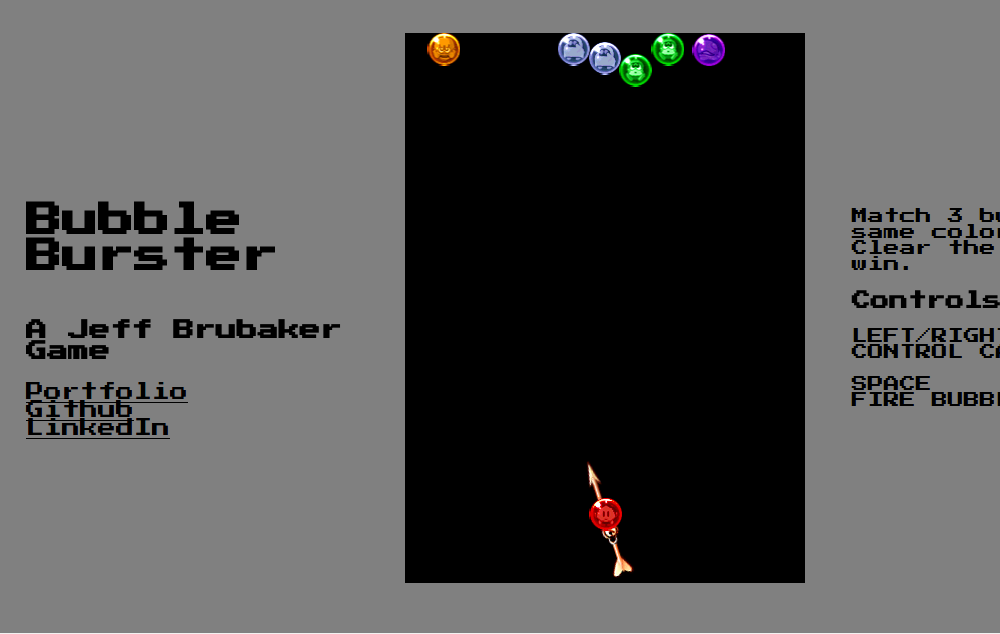

# Bubble Burster

[Bubble Burster live](https:/jeffbrubaker.me/bubble-burster)

Bubble Burster is a browser game inspired by Taito's Bust-a-Move. The goal of the game is to clear the screen of bubbles by firing bubbles toward the top of the screen and matching three of the same color. It's built entirely on Javascript and uses the jQuery and Easel.js libraries.



## Features and Implementation

### Sprite Manipulation Using Easel.js

Bubble Burster uses Easel.js extensively to make working with the HTML canvas, and particularly sprites on the canvas, much easier than with vanilla JavaScript. Adding and removing sprites from the canvas is done with a few simple lines of code. Take, for example, the cannon sprite: all we have to do is create a new createJS bitmap object with the sprite, assign it x and y properties, and add it to the stage:

```
this.cannon = new createjs.Bitmap("./sprites/cannon.png");
this.cannon.x = 200;
this.cannon.y = 485;
this.cannon.regX = 10;
this.cannon.regY = 60;
this.stage.addChild(this.cannon);
```

This is nice enough, but Easel.js also give us access to some very cool extra features. You'll notice in the above snippet that the cannon is also assigned regX and regY properties. These refer to the center of rotation on the sprite. If unchanged, it will default to the uppermost point on the sprite, but here they've been changed to the exact center point, which means the cannon will rotate around its center. The sprite also now has a rotation property, which indicates the degree of rotation in either the positive or negative direction. So, we want the press of the left or right key to move the cannon in the appropriate direction, but the cannon should never rotate more than 75 degrees in either direction. Thus, we include these lines of code in the tick function (```this.keys``` being a hash map that tracks all current depressed keys):

```
if (this.keys[37] && this.cannon.rotation >= -75) this.cannon.rotation -= 3;
if (this.keys[39] && this.cannon.rotation <= 75) this.cannon.rotation += 3;
```

### Trajectory Calculation

As a matter of fact, that aforementioned rotation property has more than one use. It also plays a key role in Bubble Burster's physics, in particular its trajectory calculation. When a new bubble is fired, the code uses the angle of the cannon's rotation to determine its path.

```
calculateXSpeed(cannon) {
  if (cannon.rotation <= -45) return -4;
  else if (cannon.rotation >= 45) return 4;
  else return (cannon.rotation / 45) * 4;
}

calculateYSpeed(cannon) {
  if (cannon.rotation >= -45 && cannon.rotation <= 45) return -4;
  else if (cannon.rotation < -45) return ((90 + cannon.rotation) / 45) * -4;
  else return ((90 - cannon.rotation) / 45) * -4;
}
```

These values become the bubble's ```speed``` values, determining how the bubble will move on the x and y axes for each refresh of the canvas. Four is our baseline number of pixels per refresh, so the bubble will always move four pixels on at least one of the axes. Thus, if the cannon is pointed at exactly 45 degrees, the bubble will move equilaterally on the axes--for each refresh, it will move four pixels right and four pixels up. But we get a little trickier based on the angle of the cannon. If it's tilted at greater than 45 degrees in either direction, then it will move further on the x axis than the y axis for each refresh, and vice versa if it's tilted at less than 45 degrees in either direction.

These values are also used to handle wall bouncing:

```
if (Util.wallDetect(this.newBubble)) obj.speed[0] *= -1;\
```

When the bubble hits a wall, its speed on the x axis is simply multiplied by -1, meaning it travels at the same rate on both axes, but in the opposite direction on the x.
