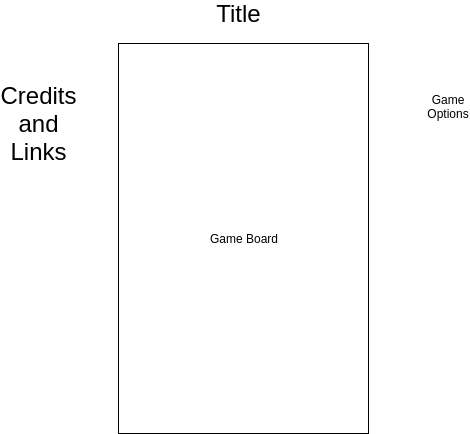

# Bubble Burster

## MVP

Bubble Burster is a JavaScript game inspired by the classic Bust a Move. The finished project will have competently style graphics, sound and music, competent physics, and a working game logic.

## Technologies

Bubble Burster will be mainly created with good old fashioned JavaScript, HTML and CSS. However, I have been looking into physics engines and will possibly be implementing one pending further research.

## Wireframe

## Timeline

Day one will be spent developing the graphics and the look of the game. This will include designing the bubbles, cannon, and backgrounds. By the end of this day I should be able to render all of the game objects on the screen.

Day two will be spent developing the physics of the game. How fast do the bubbles move after being shot, how do they react to bouncing off walls, how do they settle amongst other bubbles. By the end of the day I should be able to fire bubbles and have a coherent physics in my game.

Day three will be spent fleshing out the game's logic and applying final polish. By the end of the day there should be a working game.
